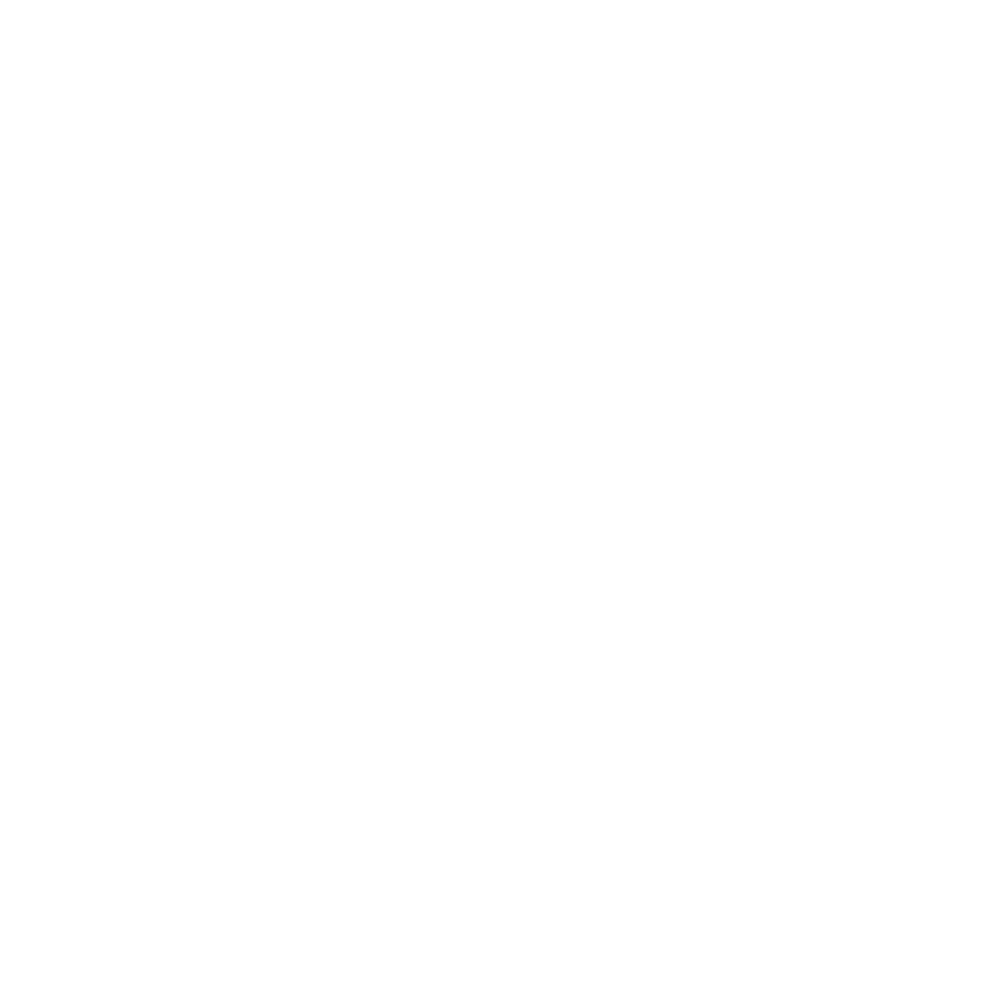

# 👋 Hi, I'm Santiago Seisdedos

  

<h3 align="center">Full Stack Developer | Web3 & AI Specialist | Passionate about Backend Architecture & Frontend Experiences</h3>

---

## 💫 About Me

- 🔭 Currently working on **Web3 integrations, blockchain protocols, AI-powered backend services**
- 🌱 Learning **Cloud architectures (GCP, Render), Threejs, AI agents & smart contracts**
- 💬 Ask me about **Node.js, TypeScript, React, React Native, Firebase, MongoDB, AutoGen, EVM & Non-EVM ecosystems**
- 📫 Contact: **santiagoseisdedos@hotmail.com**
- 📄 [LinkedIn](https://www.linkedin.com/in/santiago-seisdedos/)
- ⚡ Fun fact: My last name translates to **"six fingers"** ☝🤚

---

## 💻 Tech Stack (REACT - NODE - FIREBASE - TYPESCRIPT)

- **Frontend:** React, React Native, TypeScript, Redux, Context Api, Next.js, Vite, Three.js, Tailwind CSS, Material UI, Chakra UI, Shadcn/UI, Styled Components, Spline3D, V0, Framer Motion.
- **Backend:** Node.js, Express, Hapi, TypeScript, Python (FastAPI, Autogen), Firebase Functions, MongoDB, PostgreSQL, WebSockets.
- **Databases & Infra**: Firebase/Firestore/GCP, MongoDB, PostgreSQL, Redis, Render, Vercel, CI/CD, Docker.
- **Testing**: Jest, Mocha, Cypress, Agent-Evals.
- **AI/Agents**: OpenAI API, Autogen, RAG, LangChain, LLM-based evaluations.
- **Web3 & Blockchain:** Ethers.js, SolanaWeb3.js, RainbowKit + Metamask/Phantom/Keplr/Sui/Aptos Wallets, EVM and non-EVM chains (Solana, Sui, Cosmos).
- **DeFi & Protocols Integrations:** 
  - **Yield/Staking**: Lulo, Enso, Aave, Morpho.
  - **Routers**: Squid, LiFi, Jupiter, Cetus Protocol, Uniswap
  - **Perps**: Drift, Meteora
  - **Data**: CoinmarketCap, CoinGecko, Moralis, GoldRush (formerly Covalent)
- **Design & Multimedia:** Figma, Blender, Adobe Photoshop, Illustrator, After Effects, Premiere Pro.

---

## 📌 Featured Projects

### **🌟🤖 Automated AI / Web3 Trading System** 

**Full-Stack & End-to-End Project**: Designed and built a complete system from frontend to infrastructure.

**Key Functionalities**:

- **Frontend (React/TypeScript)**: Real-time event grid with filters and infinite pagination. Included a configurable order panel (leverage, stop-loss, take-profit) and an interactive onboarding. Integrated **Privy** for Web3 wallet management.
- **Backend (Node.js + Python)**: Orchestrated a data pipeline to sync external events, classify content with an **AI agent (GPT-4)**, detect relevant tweets, and execute automated trades on **Drift Protocol**.
- **Infrastructure**: Deployed on **Firebase Functions, Firestore, Pub/Sub**, and cronjobs for scalable background processes.
- **Technical Achievements**: Solved challenges in real-time synchronization, managing concurrency, and ensuring collateral validation and private key security.
- **Results**: Achieved **95%+ accuracy** in event detection with AI, delivering a fully automated, seamless, and scalable trading experience for users.

### **🌟🤖 DeFi Terminal + ChatBot**
- Built **backend services and AI-powered agents** for cross-chain operations  
- Integrated wallets: **Keplr, Sui, Aptos, Metamask, Phantom & Privy**
- Developed modular Node.js API to interact with smart contracts & protocols
- Designed architecture for **automated bot-driven workflows**

### **🌟 NFT Marketplace & Minting App**
- Full-stack app: **React + Node.js + MongoDB**  
- Features: NFT minting, wallet integrations (RainbowKit), marketplace functionality, Gassless transactions ("@coinbase/coinbase-sdk" MPC wallets)
- Deployed frontend & backend on **Firebase Hosting & Functions**  

---

### 🏠 **Freelance Projects**

**Texas Ranch Land – Real Estate App** (2025)

- Full-stack app for **property management**  
- Frontend: Vite, Tailwind, Shadcn | Backend: Node.js, Express  
- Focused on a **modern, user-friendly design**  
- [Live Demo](https://texas-ranch-land.com/)

[RealEstateDemo.webm](https://github.com/user-attachments/assets/a7241aa4-44df-481a-9793-3cb1eef6d51e)

---

### 💡 **Personal Projects**

**Crypto Portfolio Tracker** (2025)

- Track crypto investments, manage PnL, plan exit strategies
- Real time price updates.
- Modern UI

**D&D DungeonMaster Dashboard** (2024)

- Initiative tracker, real-time combat updates, monster/item/npc/player database
- Full character & session management
- Tech: React 19, TypeScript, Node.js, Express
- Focus: **Responsive design & modular architecture**

###  **Starlight Project** (2022)
- Individual project: country catalog app  
- Tech: React, Redux, Styled Components, Node.js, Express, PostgreSQL  
- Features: filtering, pagination, detail cards, activity creation  
- [Live Demo](https://starlight-project.vercel.app/)  

###  **Salvá Mi Huella** (2022)
- Group project: animal adoption platform  
- Tech: React, Redux, Node.js, Express, PostgreSQL, auth0  
- Features: user/shelter/admin roles, donations via PayPal, reward points, integrated store  
- [Live Demo](https://salva-mi-huella.vercel.app/)  

---

## 📊 GitHub Stats

 

---

## 🏆 GitHub Trophies

---
